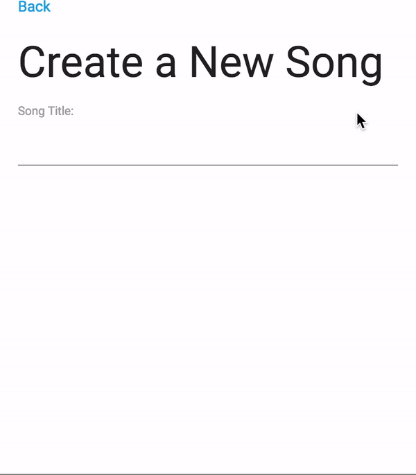

### Introduction
- Aim of this app was to improve my GraphQl and Apollo skills.
- Additionally, build using React, Node and Mongodb.
- Used boilerplate for the MongoDB and Node part.

### Functionalities App
- Allows you to add a song, assign lyrics to a song and like lyrics.
- Uses a variety of GraphQl queries and mutations.
- Uses Optimistic UI to improve the UX.

